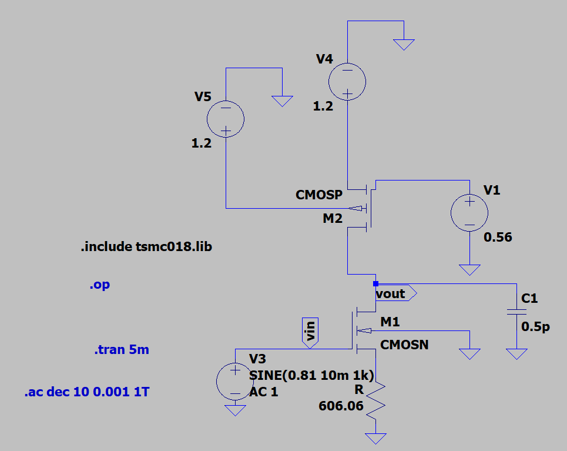

# cs-amplifier_lab2
# CMOS Amplifier Design using TSMC 180nm Technology in LTSpice

## 1. Objective

To design and analyze a CMOS amplifier using **TSMC 180nm technology** in **LTSpice** and verify the theoretical calculations with simulation results.

### Given Specifications

VDD = 1.2 V  
Power constraint P ≤ 0.4 mW  
Load capacitance CL = 0.5 pF  
Channel length L = 360 nm  

The objective is to:

1. Design the amplifier using theoretical calculations.
2. Determine transistor sizing.
3. Simulate the circuit in LTSpice.
4. Compare theoretical and simulated gain.
5. Analyze the difference between practical and theoretical values.

---

# 2. Circuit Description

The circuit consists of:

• NMOS transistor acting as the amplifying device  
• PMOS transistor acting as the active load  
• Source degeneration resistor Rs  
• Bias voltage VB  
• Output node at the drain

Configuration: **Common Source Amplifier with PMOS Active Load**

Input signal is applied to the NMOS gate.

---

# 3. Theory

A **Common Source MOS amplifier** is a fundamental analog amplifier topology.

Characteristics:

• High voltage gain  
• Phase inversion (180° phase shift)  
• Gain depends on transconductance and output resistance  

---

## MOSFET Saturation Current Equation

For MOSFET operating in saturation:

ID = (1/2) * kn' * (W/L) * (VOV)^2

Where

kn' = μn Cox  
VOV = VGS − VTH  

---

## Transconductance

gm = 2ID / VOV

---

## Output Resistance

ro = 1 / (λ ID)

---

## Voltage Gain

For source degeneration amplifier:

Av = - gm (ro1 || ro2) / (1 + gm Rs)

---

# 4. Design Calculations

## Step 1: Maximum Drain Current from Power Constraint

P ≤ VDD ID

ID = P / VDD

ID = 0.4 mW / 1.2 V

ID = 0.33 mA

ID = 330 µA

---

## Step 2: Output Voltage Selection

For symmetrical output swing:

Vout = VDD/2 + VRS

Vout = 0.6 + 0.2

Vout = 0.8 V

---

## Step 3: Overdrive Voltage

Assume:

VOV = 0.25 V  
VTH = 0.366 V  

VGS = VOV + VTH

VGS = 0.25 + 0.366

VGS = 0.61 V

---

## Step 4: Gate Voltage

VG = VGS + ID RS

Assume:

VRS = 0.2 V

VG = 0.61 + 0.2

VG = 0.81 V

---

## Step 5: Source Resistor

RS = VRS / ID

RS = 0.2 / 0.00033

RS = 606 Ω

---

# 5. NMOS Width Calculation

Drain current equation:

ID = (1/2) kn' (W/L) (VOV)^2

Where

kn' = μn Cox

μn = 273.81 cm²/Vs

Cox = εox / tox

εox = 8.854 × 10⁻¹² × 3.9

tox = 4.1 × 10⁻⁹

kn' = 2.306 × 10⁻⁴

Now solving for W:

W ≈ 16.48 µm

Thus

W1 = 16.48 µm

---

# 6. PMOS Width Calculation

For PMOS:

ID = (1/2) μp Cox (W/L) (VOV)^2

Assume

VTP = 0.39 V  
VOV = 0.25 V  
### Reason for Choosing Vov = 0.25 V

The overdrive voltage (Vov = VGS − VTH) was assumed as **0.25 V** to properly bias the MOSFET in the **saturation region** while operating under a **low supply voltage (VDD = 1.2 V)**.

Choosing Vov involves a trade-off:

1. **Ensures Saturation Operation**  
   A moderate Vov keeps the MOSFET safely in saturation where the amplifier provides stable gain.

2. **Low Power Operation**  
   Smaller Vov reduces the required drain current, helping satisfy the given power constraint.

3. **Improved Transconductance Efficiency**  
   For analog amplifiers, Vov is typically chosen in the range **0.2 V – 0.3 V** to achieve good transconductance (gm/ID efficiency).

4. **Headroom Requirement**  
   Since the supply voltage is only **1.2 V**, using a small Vov ensures enough voltage headroom for other nodes in the circuit.

Therefore, **Vov = 0.25 V** is chosen as a practical design assumption for low-voltage CMOS amplifier design

VSG = VOV + |VTP|

VSG = 0.25 + 0.39

VSG = 0.64 V

Since

VSG = VS − VG

VS = VDD

Therefore

VSG = VDD − VG

VB = 1.2 − 0.64

VB = 0.56 V

Solving current equation gives:

W2 = 39.05 µm

---

# 7. DC Operating Point (Simulation)

| Case                         | W1 (µm) | W2 (µm) | ID (µA) | Vout (V) |
|------------------------------|--------|--------|--------|---------|
| Initial Theoretical Design   | 16.48  | 39.05  | 145    | 0.14    |
| After Width Adjustment       | 75     | 95     | 323.33 | 0.83    |
### Difference Between Theoretical and Practical Current

The theoretical drain current was designed as:

ID(theoretical) = 300 µA

From LTSpice simulation:

ID(practical) = 323.33 µA

Difference:

ΔID = 323.33 µA − 300 µA = 23.33 µA

Percentage Error:

Error % = (23.33 / 300) × 100 ≈ 7.77 %

### Reason for the Difference

The difference occurs because theoretical calculations use simplified MOSFET equations, while LTSpice uses practical transistor models. The main reasons are:

1. **Channel Length Modulation (λ)** increases the drain current.
2. **Mobility degradation and short-channel effects** included in the simulator.
3. **Approximation of parameters** like VTH and VOV during hand calculations.
4. **Device sizing adjustments** during simulation (larger W increases current).

Hence, the simulated current is slightly higher than the theoretical value.

---

# 8. Transient Analysis

From the transient waveform:

VH = 0.128 V  
VL = 0.109 V  
input peak-to-peak voltage

Vin(pp) = VH − VL  

Vin(pp) = 0.128 − 0.109  

Vin(pp) = 0.019 V  

From the output waveform:

VoutH = 0.948 V  
VoutL = 0.713 V  

* output peak-to-peak voltage

Vout(pp) = VoutH − VoutL  

Vout(pp) = 0.948 − 0.713  

Vout(pp) = 0.235 V  

*voltage gain

Av = Vout(pp) / Vin(pp)

Av = 0.235 / 0.019

Av = 12.36 V/V  
* Gain to decibels

Av(dB) = 20 log(Av)

Av(dB) = 20 log(12.36)

Av(dB) = 21.84 dB
# 11. Theoretical Gain Calculation

Given

ID = 300 µA  
VOV = 0.25 V

Transconductance:

gm = 2ID / VOV

gm = 2 × 300µA / 0.25

gm = 2.4 × 10⁻³

---

Assume channel length modulation:

λ = 0.1 V⁻¹

ro = 1 / (λ ID)

ro = 1 / (0.1 × 300µA)

ro = 33333 Ω

Parallel resistance:

ro1 || ro2

= 33333 || 33333

= 16665 Ω

---

Voltage Gain

Av = - gm (ro1 || ro2) / (1 + gm Rs)

Av = - (2.4×10⁻³ × 16665) / (1 + 2.4×10⁻³ × 606)

Av = 16.294 V/V

Gain in dB:

Av = 20 log(16.294)

Av ≈ 24.24 dB

---

# 12. Comparison of Results

| Parameter | Theoretical | Practical |
|----------|-------------|-----------|
Gain | 24.24 dB | 21.52 dB |
Bandwidth | Ideal | 125 MHz |
GBP | Ideal | 1.41 GHz |
# 13. Reasons for Difference Between Theoretical and Practical Values

The theoretical calculations assume **ideal MOSFET behavior**, while LTSpice simulation uses **realistic transistor models**. The main reasons for the difference are:

### 1. Short Channel Effects

In 180 nm technology, transistors experience short channel effects which reduce current compared to ideal equations.

---

### 2. Mobility Degradation

Carrier mobility decreases at high electric fields, reducing drain current.

---

### 3. Channel Length Modulation

In practical devices, the drain current increases with VDS, reducing output resistance.

This decreases the gain.

---

### 4. Parasitic Capacitances

MOSFET includes internal capacitances such as:

Gate-source capacitance  
Gate-drain capacitance  
Junction capacitances  

These affect the AC response and bandwidth.

---

### 5. Non-Ideal MOSFET Models

LTSpice uses **BSIM transistor models** which include many second-order effects ignored in hand calculations.

---

### 6. Process Variations

Fabrication variations cause changes in:

Threshold voltage  
Mobility  
Oxide thickness  

This causes deviations from theoretical predictions.

---

# 9. AC Analysis

From AC simulation:

Av ≈ 21 dB

Upper cutoff frequency:

fH = 125.69 MHz

Lower cutoff frequency:

FL ≈ 0

Bandwidth:

BW = FH − FL

BW = 125.69 MHz

---

# 10. Gain Bandwidth Product

GBP = Av × BW

Convert gain to linear:

Av = 10^(21/20)

Av = 11.22

GBP = 11.22 × 125.69 MHz

GBP ≈ 1.41 GHz

Unity gain bandwith:
UGB=2.05GHz

---

